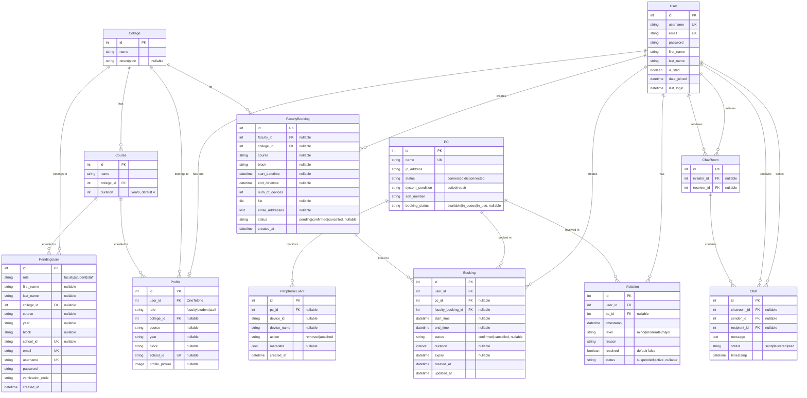

# PCheck System - Entity Relationship Diagram (ERD)

## Complete Database Schema

## Entity Descriptions

### Core User Entities

**User** (Django Auth)
- Primary authentication entity
- Stores username, email, password
- Linked to Profile via OneToOne relationship

**Profile**
- Extended user information
- One-to-One with User
- Stores role, college, course, year, block, school_id
- Optional profile picture

**PendingUser**
- Temporary storage during registration
- Stores registration data before account creation
- Deleted after successful verification

### Academic Entities

**College**
- Represents academic colleges/departments
- Has many Courses
- Referenced by Profile, PendingUser, FacultyBooking

**Course**
- Academic courses/programs
- Belongs to a College
- Has duration (years)

### PC Management Entities

**PC**
- Computer/lab machine information
- Tracks status (connected/disconnected)
- Tracks system condition (active/repair)
- Tracks booking status (available/in_queue/in_use)
- Has unique name and IP address

**PeripheralEvent**
- Monitors USB/peripheral device changes
- Tracks device attachment/removal
- Linked to PC (nullable for system-wide events)
- Stores device metadata as JSON

### Booking Entities

**Booking**
- Individual PC booking record
- Created by User (student)
- Linked to PC
- Can be linked to FacultyBooking (for bulk bookings)
- Tracks start_time, end_time, duration, expiry
- Status: confirmed or cancelled

**FacultyBooking**
- Bulk booking for class sessions
- Created by Faculty User
- Linked to College
- Contains course, block, date/time range
- Stores student email addresses
- Optional file attachment
- Status: pending, confirmed, or cancelled

### Communication Entities

**ChatRoom**
- Conversation container
- Links two Users (initiator and receiver)
- Can be between staff and student/faculty

**Chat**
- Individual message in a conversation
- Belongs to ChatRoom
- Has sender and recipient (redundant but useful)
- Tracks message status (sent, delivered, read)
- Stores message text and timestamp

### Violation Entity

**Violation**
- User violation/suspension record
- Created by Staff
- Linked to User (required)
- Linked to PC (optional)
- Tracks violation level, reason, resolution status
- Status: suspended or active

## Relationship Details

### One-to-One Relationships
- **User ↔ Profile**: Each user has exactly one profile (OneToOne)

### One-to-Many Relationships
- **User → Booking**: User can create multiple bookings
- **User → FacultyBooking**: Faculty can create multiple bulk bookings
- **User → Violation**: User can have multiple violations
- **User → ChatRoom**: User can initiate/receive multiple conversations
- **User → Chat**: User can send/receive multiple messages
- **College → Course**: College has many courses
- **College → Profile**: College has many profiles
- **College → FacultyBooking**: College has many faculty bookings
- **PC → Booking**: PC can have multiple bookings (over time)
- **PC → Violation**: PC can be involved in multiple violations
- **PC → PeripheralEvent**: PC can have multiple peripheral events
- **FacultyBooking → Booking**: Faculty booking can have multiple individual bookings
- **ChatRoom → Chat**: ChatRoom contains multiple messages

### Many-to-One Relationships
- **Profile → College**: Many profiles belong to one college
- **Profile → User**: Many profiles belong to one user (but OneToOne enforces one)
- **Course → College**: Many courses belong to one college
- **Booking → User**: Many bookings belong to one user
- **Booking → PC**: Many bookings can be for one PC (over time)
- **Booking → FacultyBooking**: Many bookings can link to one faculty booking
- **Violation → User**: Many violations belong to one user
- **Violation → PC**: Many violations can involve one PC
- **PeripheralEvent → PC**: Many events can be for one PC
- **Chat → ChatRoom**: Many messages belong to one chat room
- **Chat → User**: Many messages sent/received by one user

## Key Constraints

1. **Unique Constraints**:
   - User.username (unique)
   - User.email (unique)
   - Profile.school_id (unique, nullable)
   - PC.name (unique)
   - PendingUser.email (unique)
   - PendingUser.username (unique)
   - PendingUser.school_id (unique, nullable)

2. **Foreign Key Constraints**:
   - Profile.user_id → User.id (CASCADE delete)
   - Booking.user_id → User.id (CASCADE delete)
   - Booking.pc_id → PC.id (CASCADE delete, nullable)
   - Booking.faculty_booking_id → FacultyBooking.id (CASCADE delete, nullable)
   - Violation.user_id → User.id (CASCADE delete)
   - Violation.pc_id → PC.id (CASCADE delete, nullable)
   - PeripheralEvent.pc_id → PC.id (SET_NULL delete, nullable)

3. **Nullable Fields**:
   - Many foreign keys are nullable to allow flexible relationships
   - Optional fields like course, year, block can be null
   - File uploads and metadata fields are nullable

## Indexes and Performance

- Primary keys are auto-indexed
- Foreign keys are typically indexed
- Unique constraints create indexes
- Consider adding indexes on:
  - Booking.status, Booking.end_time (for cleanup queries)
  - Chat.timestamp (for message ordering)
  - Violation.status (for filtering suspended users)
  - PC.booking_status (for availability queries)

