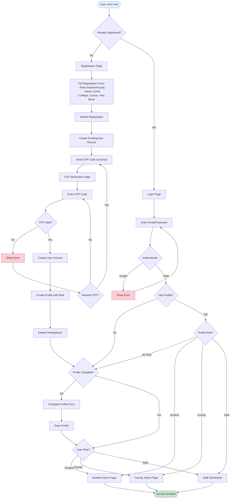

# User Registration & Authentication Flow

## Process Steps:

1. **Registration**
   - User fills registration form with role, personal info, college details
   - System creates PendingUser record
   - OTP code sent to email
   - User verifies OTP
   - User account and profile created
   - PendingUser deleted

2. **Login**
   - User enters credentials
   - System authenticates
   - Checks for profile completion
   - Redirects based on role

3. **Profile Completion**
   - Required if profile incomplete or missing role
   - User selects role and completes details
   - Redirects to appropriate home page

