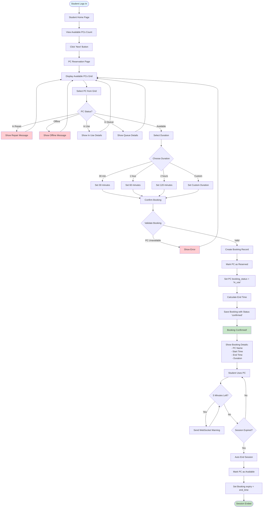

# Student PC Booking Flow

## Process Steps:

1. **View Available PCs**
   - Student sees available PC count on home page
   - Clicks to view reservation page

2. **Select PC**
   - Views grid of available PCs
   - Selects an available PC
   - System validates PC status

3. **Set Duration**
   - Choose from preset durations or custom
   - Confirm booking

4. **Booking Creation**
   - System creates Booking record
   - Marks PC as 'in_use'
   - Calculates end time based on duration

5. **Session Management**
   - Student uses PC
   - System sends warning 5 minutes before expiry
   - Auto-ends session when time expires
   - Frees PC for next user

