# Faculty Bulk Booking Flow

```mermaid
flowchart TD
    Start([Faculty Logs In]) --> HomePage[Faculty Home Page]
    HomePage --> BulkBookingOption[Click 'Bulk booking for class']
    BulkBookingOption --> BookingForm[Faculty Booking Form]
    
    BookingForm --> Step1[Step 1: Class Details]
    Step1 --> FillClassInfo[Fill Class Information:<br/>- Course<br/>- Block<br/>- College]
    FillClassInfo --> Step2[Step 2: Date & Time]
    
    Step2 --> FillDateTime[Fill Date/Time:<br/>- Start Date/Time<br/>- End Date/Time<br/>- Number of PCs]
    FillDateTime --> Step3[Step 3: Student Emails]
    
    Step3 --> EnterEmails[Enter Student Email Addresses<br/>Comma or newline separated]
    EnterEmails --> Step4[Step 4: Upload Attachment]
    
    Step4 --> UploadFile{Upload File?}
    UploadFile -->|Yes| SelectFile[Select File]
    UploadFile -->|No| ReviewBooking
    SelectFile --> ReviewBooking[Review Booking Details]
    
    ReviewBooking --> SubmitBooking[Submit Booking Request]
    SubmitBooking --> CreateFacultyBooking[Create FacultyBooking Record<br/>Status: 'pending']
    CreateFacultyBooking --> ConfirmationPage[Booking Confirmation Page]
    ConfirmationPage --> WaitApproval[Wait for Staff Approval]
    
    WaitApproval --> StaffReview[Staff Reviews Booking]
    StaffReview --> StaffDecision{Staff Decision?}
    
    StaffDecision -->|Approve| ApproveBooking[Staff Approves Booking]
    StaffDecision -->|Decline| DeclineBooking[Staff Declines Booking]
    
    ApproveBooking --> UpdateStatus[Set Status = 'confirmed']
    UpdateStatus --> GenerateQR[Generate QR Code URL]
    GenerateQR --> SendEmails[Send Emails to Students<br/>with QR Code]
    SendEmails --> EmailSent[Emails Sent Successfully]
    
    DeclineBooking --> UpdateStatusDeclined[Set Status = 'cancelled']
    UpdateStatusDeclined --> NotifyFaculty[Notify Faculty]
    
    EmailSent --> StudentReceives[Students Receive Email]
    StudentReceives --> StudentScans[Student Scans QR Code]
    StudentScans --> QRValidation[Validate QR Code]
    
    QRValidation --> CheckBooking{Booking Valid?}
    CheckBooking -->|Invalid| InvalidQR[Show Error Message]
    CheckBooking -->|Valid| CheckDate{Date/Time Valid?}
    
    CheckDate -->|Invalid| DateError[Show Date Error]
    CheckDate -->|Valid| AssignPCs[Assign Available PCs]
    
    AssignPCs --> CheckAvailable{Enough PCs Available?}
    CheckAvailable -->|No| NotEnoughPCs[Show 'Not Enough PCs' Error]
    CheckAvailable -->|Yes| MarkPCs[Mark PCs as 'in_use']
    
    MarkPCs --> CreateBookings[Create Booking Records<br/>for Each PC]
    CreateBookings --> LinkFacultyBooking[Link to FacultyBooking]
    LinkFacultyBooking --> AccessGranted[Access Granted to Lab]
    AccessGranted --> UseLab[Students Use Lab]
    
    UseLab --> CheckEndTime{End Time Reached?}
    CheckEndTime -->|No| UseLab
    CheckEndTime -->|Yes| FreeAllPCs[Free All Assigned PCs]
    FreeAllPCs --> End([Bulk Booking Session Ended])
    
    style Start fill:#e1f5ff
    style End fill:#c8e6c9
    style InvalidQR fill:#ffcdd2
    style DateError fill:#ffcdd2
    style NotEnoughPCs fill:#ffcdd2
    style EmailSent fill:#c8e6c9
    style AccessGranted fill:#c8e6c9
```

## Process Steps:

1. **Booking Request**
   - Faculty fills multi-step form
   - Provides class details, date/time, student emails
   - Optionally uploads attachment
   - Submits for approval

2. **Staff Approval**
   - Staff reviews booking request
   - Approves or declines
   - If approved, generates QR code

3. **Email Distribution**
   - System sends emails to all students
   - Each email contains QR code for access

4. **QR Code Access**
   - Student scans QR code
   - System validates booking
   - Assigns available PCs
   - Grants lab access

5. **Session Management**
   - Students use assigned PCs
   - System frees PCs when end time reached
   - All bookings linked to faculty booking

