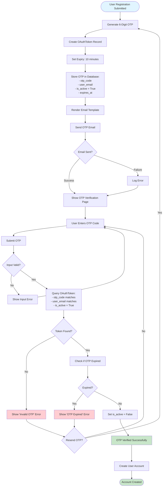

# OTP Verification Flow

## Process Steps:

1. **OTP Generation**
   - System generates random 6-digit code
   - Creates OAuthToken record
   - Sets 10-minute expiry

2. **Email Sending**
   - Renders email template with OTP
   - Sends to user's email address
   - Handles email failures gracefully

3. **OTP Verification**
   - User enters OTP code
   - System queries database
   - Validates code, email, and expiry
   - Deactivates OTP after successful verification

4. **Error Handling**
   - Invalid OTP: Code doesn't match
   - Expired OTP: Past 10-minute window
   - Option to resend OTP

