# Violation & Suspension Flow

```mermaid
flowchart TD
    Start([Staff Monitors User Activity]) --> ViewActivities[View User Activities Page]
    ViewActivities --> DetectViolation{Detect Violation?}
    
    DetectViolation -->|No| ContinueMonitor[Continue Monitoring]
    ContinueMonitor --> ViewActivities
    
    DetectViolation -->|Yes| SelectUser[Select User with Violation]
    SelectUser --> ChoosePC{Select PC?}
    
    ChoosePC -->|Yes| SelectPC[Select PC from List]
    ChoosePC -->|No| NoPC[No PC Selected]
    
    SelectPC --> EnterViolation[Enter Violation Details]
    NoPC --> EnterViolation
    
    EnterViolation --> FillDetails[Fill Violation Form:<br/>- Level Warning/Suspension<br/>- Reason]
    FillDetails --> SubmitViolation[Submit Violation]
    
    SubmitViolation --> CreateViolation[Create Violation Record:<br/>- user<br/>- pc optional<br/>- level<br/>- reason<br/>- status = 'suspended']
    
    CreateViolation --> SuspendUser[Suspend User Account]
    SuspendUser --> UpdateProfile[Update User Profile<br/>if needed]
    UpdateProfile --> ShowConfirmation[Show 'Account Suspended' Message]
    ShowConfirmation --> ViolationList[Add to Violations List]
    
    ViolationList --> ViewSuspended[View Suspended Users]
    ViewSuspended --> StaffReview{Staff Reviews}
    
    StaffReview --> Decision{Decision?}
    Decision -->|Unsuspend| ClickUnsuspend[Click Unsuspend Button]
    Decision -->|Keep Suspended| ViewSuspended
    
    ClickUnsuspend --> ConfirmModal[Show Confirmation Modal]
    ConfirmModal --> Confirm{Confirm?}
    
    Confirm -->|No| ViewSuspended
    Confirm -->|Yes| UpdateViolation[Update Violation:<br/>- status = 'active'<br/>- resolved = True]
    
    UpdateViolation --> UnsuspendUser[Unsuspend User Account]
    UnsuspendUser --> ShowSuccess[Show 'Account Unsuspended' Message]
    ShowSuccess --> RemoveFromList[Remove from Suspended List]
    RemoveFromList --> End([User Can Access System])
    
    style Start fill:#e1f5ff
    style End fill:#c8e6c9
    style SuspendUser fill:#ffcdd2
    style UnsuspendUser fill:#c8e6c9
```

## Process Steps:

1. **Violation Detection**
   - Staff monitors user activities
   - Identifies violations or misconduct
   - Selects user and optionally PC

2. **Violation Creation**
   - Staff enters violation details
   - Sets level (warning/suspension)
   - Provides reason
   - System creates Violation record

3. **Suspension**
   - User account suspended
   - Status set to 'suspended'
   - User cannot access system

4. **Unsuspension**
   - Staff reviews suspended users
   - Decides to unsuspend
   - Confirms action
   - System updates violation status
   - User regains access

