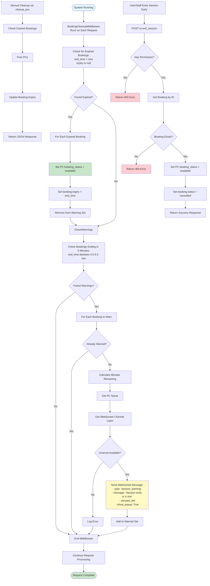

# Session Management & Cleanup Flow

## Process Steps:

1. **Automatic Cleanup (Middleware)**
   - Runs on every request
   - Checks for expired bookings
   - Frees PCs automatically
   - Updates booking expiry timestamp

2. **Session Warnings**
   - Checks bookings ending in 5 minutes
   - Sends WebSocket warnings to PC
   - Tracks warned bookings to avoid duplicates
   - Shows popup notification on PC

3. **Manual Cleanup**
   - Staff can trigger cleanup manually
   - Clears all expired bookings
   - Returns status message

4. **Early Session End**
   - User or staff can end session early
   - Validates permissions
   - Frees PC immediately
   - Cancels booking

