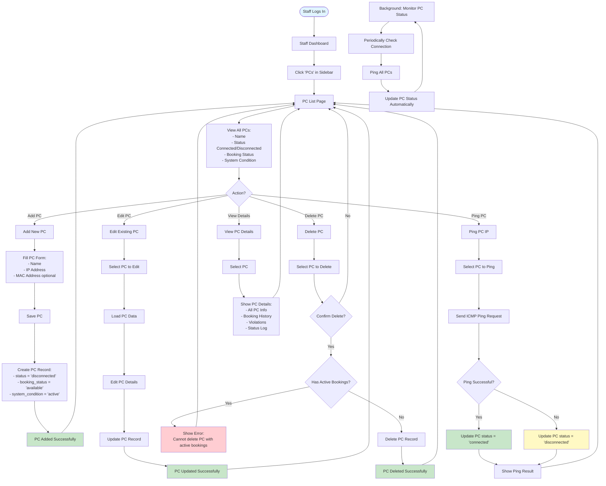

# PC Management Flow (Staff)

## Process Steps:

1. **View PCs**
   - Staff views list of all PCs
   - Sees current status and booking state
   - Can filter and search

2. **Add PC**
   - Enter PC details (name, IP, MAC)
   - System creates PC record
   - Initial status: disconnected

3. **Edit PC**
   - Select PC to edit
   - Update details
   - Save changes

4. **Delete PC**
   - Select PC to delete
   - System checks for active bookings
   - Cannot delete if bookings exist
   - Confirms and deletes

5. **Ping PC**
   - Test PC connectivity
   - Updates status based on ping result
   - Shows connection status

6. **Monitor Status**
   - Background process pings PCs
   - Automatically updates connection status
   - Keeps status current

