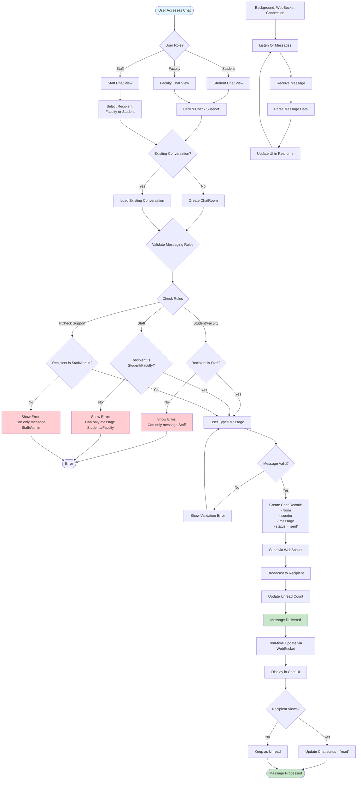

# Chat/Messaging System Flow

## Process Steps:

1. **Access Chat**
   - User clicks chat/support link
   - System checks user role
   - Loads appropriate chat interface

2. **Conversation Management**
   - Checks for existing conversation
   - Creates new ChatRoom if needed
   - Links initiator and receiver

3. **Messaging Rules**
   - **Students**: Can only message Staff/Admin
   - **Faculty**: Can only message Staff/Admin
   - **Staff**: Can message Students/Faculty (not other staff)
   - **PCheck Support**: Can message Staff/Admin only

4. **Message Sending**
   - User types and sends message
   - System validates message
   - Creates Chat record
   - Broadcasts via WebSocket

5. **Real-time Updates**
   - WebSocket connection maintains real-time sync
   - Messages appear instantly
   - Unread count updates automatically
   - Status changes (sent → read)

