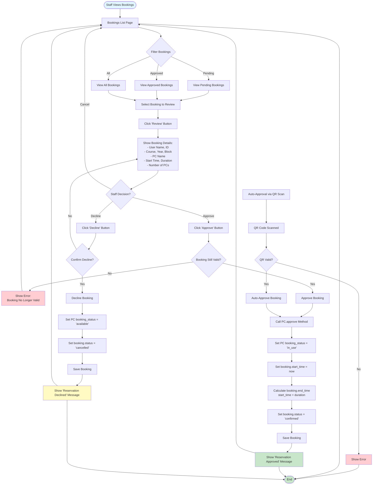

# Student Booking Approval Flow (Staff)

## Process Steps:

1. **View Bookings**
   - Staff accesses bookings page
   - Can filter by status (pending, approved, all)
   - Views list of bookings

2. **Review Booking**
   - Staff clicks 'Review' on a booking
   - System displays full booking details
   - Shows user info, PC info, timing

3. **Approve Booking**
   - Staff clicks 'Approve'
   - System validates booking is still valid
   - Marks PC as 'in_use'
   - Sets start time and calculates end time
   - Sets status to 'confirmed'
   - Shows success message

4. **Decline Booking**
   - Staff clicks 'Decline'
   - Confirms action
   - Frees PC (sets to 'available')
   - Sets booking status to 'cancelled'
   - Shows decline message

5. **Auto-Approval**
   - QR code scan can auto-approve
   - Validates QR code
   - Automatically approves booking
   - Redirects to dashboard

