# Peripheral Device Monitoring Flow

```mermaid
flowchart TD
    Start([PC Monitoring Script Starts]) --> InitScript[Initialize Watch-Peripherals.ps1]
    InitScript --> GetPCName[Get PC Name from Environment]
    GetPCName --> SetServer[Set Server URL]
    SetServer --> InitialSnapshot[Take Initial Device Snapshot]
    
    InitialSnapshot --> GetDevices[Get All USB/Peripheral Devices:<br/>- Keyboards<br/>- Mice<br/>- USB Devices<br/>- Audio Devices<br/>- Bluetooth Devices]
    GetDevices --> StoreSnapshot[Store Device IDs and Names]
    StoreSnapshot --> StartLoop[Start Monitoring Loop]
    
    StartLoop --> WaitInterval[Wait Interval Seconds default: 2s]
    WaitInterval --> GetCurrentSnapshot[Get Current Device Snapshot]
    GetCurrentSnapshot --> CompareDevices[Compare with Previous Snapshot]
    
    CompareDevices --> CheckAdded{New Devices Added?}
    CheckAdded -->|Yes| DetectAdded[Detect Added Devices]
    CheckAdded -->|No| CheckRemoved
    
    DetectAdded --> SendAddedEvent[Send 'attached' Event:<br/>- pc_name<br/>- device_id<br/>- device_name<br/>- action = 'attached']
    SendAddedEvent --> PostToServer[POST to /ajax/peripheral-event/]
    
    CheckRemoved{Devices Removed?}
    CheckRemoved -->|Yes| DetectRemoved[Detect Removed Devices]
    CheckRemoved -->|No| UpdateSnapshot
    
    DetectRemoved --> SendRemovedEvent[Send 'removed' Event:<br/>- pc_name<br/>- device_id<br/>- device_name<br/>- action = 'removed']
    SendRemovedEvent --> PostToServer
    
    PostToServer --> ServerReceive[Server Receives Event]
    ServerReceive --> FindPC[Find PC by Name]
    FindPC --> CreateEvent[Create PeripheralEvent Record:<br/>- pc<br/>- device_id<br/>- device_name<br/>- action<br/>- metadata]
    
    CreateEvent --> CheckAction{Action Type?}
    CheckAction -->|removed| AlertStaff[Alert Staff via WebSocket]
    CheckAction -->|attached| LogOnly[Log Event Only]
    
    AlertStaff --> BroadcastAlert[Broadcast to 'alerts_staff' Group]
    BroadcastAlert --> WebSocketMessage[Send WebSocket Message:<br/>- type: 'alert'<br/>- title: 'Peripheral change'<br/>- message: PC + device + action<br/>- payload: event data]
    
    WebSocketMessage --> StaffReceives[Staff Receives Alert]
    StaffReceives --> DisplayAlert[Display Alert in Dashboard]
    DisplayAlert --> AddToWarnings[Add to Warning List if 'removed']
    AddToWarnings --> UpdateBadge[Update Warning Badge Count]
    UpdateBadge --> End([Event Processed])
    
    LogOnly --> End
    UpdateSnapshot[Update Previous Snapshot] --> StartLoop
    
    ManualTrigger[Manual Trigger] --> RunScript[Run Watch-Peripherals.ps1]
    RunScript --> InitScript
    
    AutoStart[Auto-Start on PC Boot] --> CheckConfig[Check pc-notification-config.txt]
    CheckConfig --> LoadConfig[Load PC Name and Server]
    LoadConfig --> RunScript
    
    style Start fill:#e1f5ff
    style End fill:#c8e6c9
    style AlertStaff fill:#fff9c4
    style DisplayAlert fill:#fff9c4
```

## Process Steps:

1. **Script Initialization**
   - PowerShell script starts on PC
   - Gets PC name from environment
   - Sets server URL
   - Takes initial device snapshot

2. **Continuous Monitoring**
   - Script runs in loop (every 2 seconds)
   - Takes current device snapshot
   - Compares with previous snapshot
   - Detects added/removed devices

3. **Event Detection**
   - **Added**: New device connected
   - **Removed**: Device disconnected
   - Captures device ID and name

4. **Event Transmission**
   - Sends POST request to server
   - Includes PC name, device info, action
   - Server creates PeripheralEvent record

5. **Staff Alerting**
   - Removed devices trigger alerts
   - WebSocket broadcasts to staff
   - Dashboard displays real-time warnings
   - Warning list and badge update

6. **Auto-Start**
   - Script can auto-start on PC boot
   - Reads configuration file
   - Starts monitoring automatically

