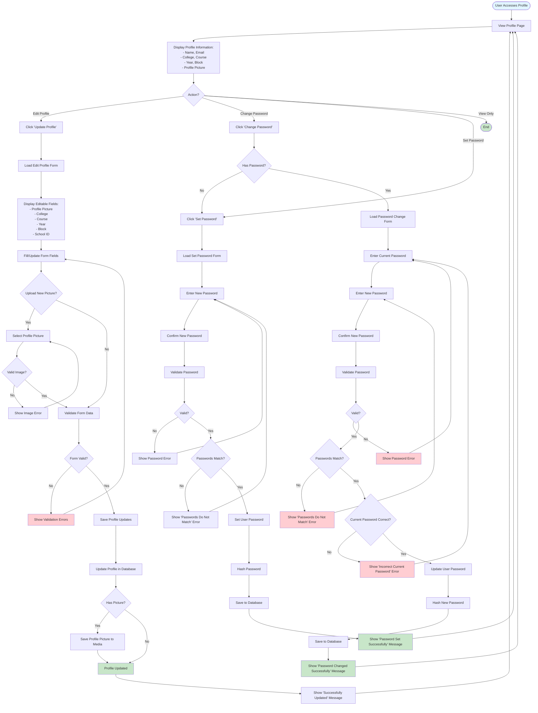

# Profile Management Flow

## Process Steps:

1. **View Profile**
   - User accesses profile page
   - System displays current profile information
   - Shows profile picture, college, course details

2. **Edit Profile**
   - User clicks 'Update Profile'
   - System loads edit form
   - User can update:
     - Profile picture
     - College
     - Course
     - Year
     - Block
     - School ID
   - Validates and saves changes

3. **Change Password**
   - User clicks 'Change Password'
   - System checks if password exists
   - User enters:
     - Current password
     - New password
     - Confirm new password
   - Validates all inputs
   - Updates password in database

4. **Set Password**
   - For users without password (OAuth users)
   - User enters new password twice
   - Validates password strength
   - Sets password in database

5. **Validation**
   - All forms validate input
   - Password must meet requirements
   - Profile picture must be valid image
   - Shows appropriate error messages

