# Google OAuth Login Flow

```mermaid
flowchart TD
    Start([User Clicks 'Sign in with Google']) --> InitOAuth[Initialize Google OAuth]
    InitOAuth --> RedirectGoogle[Redirect to Google OAuth]
    RedirectGoogle --> GoogleLogin[User Logs in with Google]
    
    GoogleLogin --> GoogleAuth{Google Authentication Successful?}
    GoogleAuth -->|No| AuthError[Show Authentication Error]
    AuthError --> LoginPage[Return to Login Page]
    
    GoogleAuth -->|Yes| GoogleCallback[Google Redirects Back with Code]
    GoogleCallback --> ExchangeCode[Exchange Code for Access Token]
    ExchangeCode --> GetUserInfo[Get User Info from Google]
    
    GetUserInfo --> ExtractEmail[Extract Email Address]
    ExtractEmail --> CheckEmail{PSU Email?}
    
    CheckEmail -->|Yes @psu.palawan.edu.ph| ExtractSchoolID[Extract School ID from Email]
    CheckEmail -->|No| ManualSchoolID[Prompt for School ID]
    
    ExtractSchoolID --> CheckExisting{User Exists?}
    ManualSchoolID --> CheckExisting
    
    CheckExisting -->|Yes| LinkAccount[Link Google Account to Existing User]
    CheckExisting -->|No| CreateNewUser[Create New User Account]
    
    LinkAccount --> UpdateSocialAccount[Update/Create SocialAccount]
    CreateNewUser --> CreateUser[Create User with Google Info]
    CreateUser --> CreateSocialAccount[Create SocialAccount Link]
    
    UpdateSocialAccount --> CheckProfile{Has Profile?}
    CreateSocialAccount --> CheckProfile
    
    CheckProfile -->|No| CreateProfile[Create Profile]
    CheckProfile -->|Yes| CheckRole{Has Role?}
    
    CreateProfile --> SetSchoolID[Set School ID from Email or Manual]
    SetSchoolID --> CheckRole
    
    CheckRole -->|No| CompleteProfile[Redirect to Complete Profile]
    CheckRole -->|Yes| CheckPassword{Has Password?}
    
    CompleteProfile --> FillProfile[Fill Profile Form:<br/>- Role Student/Faculty/Staff<br/>- College<br/>- Course, Year, Block]
    FillProfile --> SaveProfile[Save Profile]
    SaveProfile --> CheckPassword
    
    CheckPassword -->|No| SetPassword[Redirect to Set Password]
    CheckPassword -->|Yes| RedirectRole{User Role?}
    
    SetPassword --> EnterPassword[User Sets Password]
    EnterPassword --> SavePassword[Save Password]
    SavePassword --> RedirectRole
    
    RedirectRole -->|Student| StudentHome[Redirect to Student Home]
    RedirectRole -->|Faculty| FacultyHome[Redirect to Faculty Home]
    RedirectRole -->|Staff| StaffDashboard[Redirect to Staff Dashboard]
    
    StudentHome --> End([Login Complete])
    FacultyHome --> End
    StaffDashboard --> End
    LoginPage --> End
    
    style Start fill:#e1f5ff
    style End fill:#c8e6c9
    style AuthError fill:#ffcdd2
    style CompleteProfile fill:#fff9c4
    style SetPassword fill:#fff9c4
```

## Process Steps:

1. **OAuth Initiation**
   - User clicks 'Sign in with Google'
   - System redirects to Google OAuth
   - User authenticates with Google

2. **Callback Processing**
   - Google redirects back with authorization code
   - System exchanges code for access token
   - Retrieves user information from Google

3. **Account Linking**
   - System extracts email from Google account
   - Checks if user exists by email
   - Links Google account to existing user OR creates new user

4. **School ID Extraction**
   - If PSU email (@psu.palawan.edu.ph), extracts school ID
   - If non-PSU email, prompts for school ID manually

5. **Profile Completion**
   - Checks if profile exists
   - If no profile or missing role, redirects to complete profile
   - User fills role, college, course details

6. **Password Setup**
   - Checks if user has password
   - If no password (OAuth-only user), redirects to set password
   - User creates password for future logins

7. **Role-Based Redirect**
   - After profile/password setup, redirects based on role:
     - Student → Student Home
     - Faculty → Faculty Home
     - Staff → Staff Dashboard

